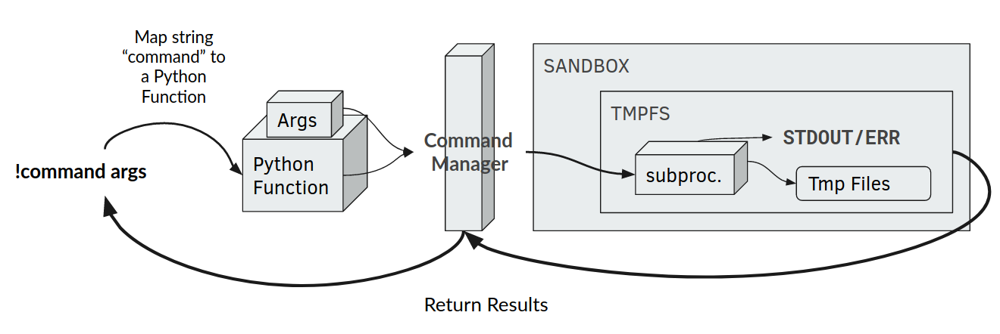
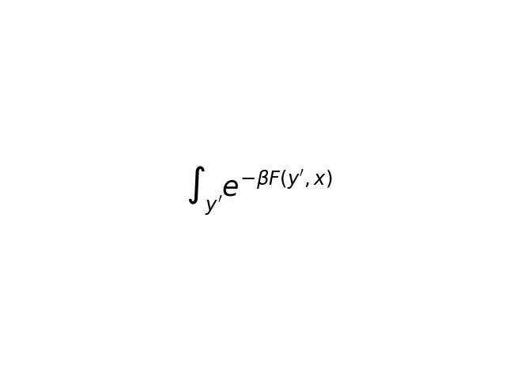

# ResearchRealms
A Slack and Discord Bot for Quantitative Research in Python

[Add this bot to your discord server!](https://discordapp.com/api/oauth2/authorize?client_id=700004199844282369&permissions=593024&scope=bot)

# Table of Contents

## Documentation
* Report: This document
* Presentation: `doc/showcase.pdf`
* Requirements Analysis: `doc/req`
* Business Model Canvas: `doc/bmc`
* Use Case Documentation: `doc/use`
* UML: `doc/uml`

## Source Code
* Core framework: `core/`
* Discord Wrapper: `discord_bot.py`

# Abstract

Given the extraordinary circumstances that many academics and researchers are now facing in early 2020, 
many of us are constrained to collaborate with our colleagues from our own homes. Somewhat ironically, 
there are few easy-to-use tools which allow researchers from mathematical backgrounds to share quick ideas efficiently. 
Many people across fields use apps like Discord or Slack to work remotely. However, these apps lack critical features 
for technical users like code formatting, or LaTeX support.

We aim to fix this by offering a Discord (and or Slack) Bot which offers proper LaTeX formatting, 
Python Code snippet execution and formatting, and the ability to search for other researchers in public (yet academic) 
servers by their titles or fields. In this way, we also aim to develop a community in which researchers can 
collaborate easily across domains, with fewer barriers between different research departments.

# Introduction

**ResearchRealms** is a Python program and execution environment for running arbitrary code. 
Its purpose is to be extensible, and easy to run your own instance. 
ResearchRealms is made to run on cloud machines with high-replication in mind. 
Each quantum of computation in ResearchRealms is naturally parallel and containerized using our `command` framework.

The `command` framework is what makes ResearchRealms unique. It is self-bootstrapping: 
While this framework supports running arbitrary code from Slack and Discord, it is also used to 
*execute our built-in commands*. It is containerized: In this way, we are able to *share the same environment* 
that ResearchRealms uses to run, to also run arbitrary code.


# Cross-Cutting Aspects

All of our design documents can be found under the `doc/` directory of this repository. It contains:

* Business Model Canvas
* UML Architecture
* Requirements Documentation
* Use-Case Documentation

We designed this project by first documenting the functional requirements, and then expanding upon those by defining 
the non-functional requirements. This is documented in the **Requirements Documentation**. Moreover, we define some 
key use-cases (documented in the **Use-Case Documentation**) and implemented the core use-case: Executing arbitrary 
Python code. Once we knew how our application needed to perform, we worked on designing an architecture and how to 
implement it. This is documented in the **UML Architecture**.

Finally, we thought about how this application fits into the overall objectives of a business. This was an 
interesting exercise for us, because our application isn't necessarily geared towards business needs, but rather 
academic needs. Moreover, the P2P nature of the application isn't as monolithic as most business applications. 
Nonetheless, we attempted to frame the application within a business scenario, and outlined that context in the 
**Business Model Canvas**.

# Development

We used an agile process for developing this software. Features were laid out after the project was given 
the green-light, and we then met together to turn those features into functional and non-functional requirements. 
In the design phase, we laid out a UML diagram of how those features would interact. Then it was a matter of 
implementing the UML. We divided the parts evenly such that we could work in parallel for most of the project.

An interesting part of the development cycle was in the **Latex parser**, where we decided to reuse as much code 
as possible, and implement it as a **special Python program delivered to the `exec` routine**. This `exec` routine
we developed is to execute arbitrary Python code. For this reason, we can actually leverage it to **implement many 
other commands**. This in turn allows us to re-use the most amount of code possible. Below, you can find a high-level
diagram on how the Executor (which implements `exec`) works.



# Testing

We tested our `exec` and `latex` routines on various test programs. We also tested malicious programs that leverage `os` and telemetry to circumvent the sandbox. This allowed us to come up with a list of packages to forbid in the sandbox. Which are default in this repository. This program has been vetted on both Linux and MacOS. 

# Deployment

The deployment for this app is incredibly flexible. We propose that the optimal way to deploy it would be using a **Docker instance load-balanced with Kubernetes**, to make it truely P2P. However, it's easy for anyone to run a node, or even use our code to register their own bot. However, it will run just fine on a free-tier Heroku or AWS VM.

There are **no extra steps for deployment**. Simply set up your Python environment, run with`python discord_bot.py`, and ensure the machine or VM has access to the internet. 

# Setup

## Discord
For most users, clicking the link in the top of this document and choosing the target server should be sufficient. 
**It is possible to run your own node** by running the `discord_bot.py` python file. 
You are free to modify this file, and create your bot on top of this framework.

## Slack
TODO

## Rolling your own instance

Rolling your own instance only requires a few extra steps. You will want to have the following in-place before you begin:

1. A computer that can act as a server (A Free Tier AWS EC2 instance is perfectly sufficient)
2. `python 3` installed
3. `virtualenv` installed

Now, we will set up the Python environment which will be available to the `!exec` command.

1. Add the packages you would like to be available in the `requirements.txt` file
2. Create the virtual environment: `virtualenv venv --python=$(which python3)`
3. Activate the `venv` and install the packages: `source venv/bin/activate && pip install -r requirements.txt`

The Code Snippet saving functionality works over MongoDB. To use this functionality on your own, you will
need to have a MongoDB database running, and have its connection URL ready.

**Discord**

For Discord, you will need your own **bot key** to run your own instance. Make a new application in Discord's
[Developer Portal](https://discord.com/developers/applications), then obtain the bot's **Token**. You will need to
give permission for your bot to read and write messages within the channels you want it in. Finally, add the bot to
your server.

Using the token you obtained, run ResearchRealms using the following script:

    #!/bin/bash
    
    export TOKEN=<your bot token>
    export MONGO_CONNECTION_STRING=<your mongodb connection string>
    
    source venv/bin/activate
    python discord_bot.py
    

# Commands

## `!exec`

The `exec` command allows you and your colleagues to **execute small python snippets** directly
from Slack or Discord. Under the hood, `exec` supports a number of features, offered transparently
to the user.

### Formatting

    !exec
    ```python
    import matplotlib.pyplot as plt
    print('hello wolrd!')
    plt.figure()
    plt.plot([1, 2])
    plt.title("test")
    plt.show()
    ```
Formatting ticks \`\`\` will be removed automatically, but there should be at least a space between
them and the code. `exec` will deliver back to your channel the **standard output** of the program.

### Attachments

`exec` supports attachments. You can send up to one attachment with your Python
program. It will be available by its **original file name** at the **current directory**.

### Matplotlib

`exec` supports matplotlib. If you write `plt.show()` in your program. RR will capture this and
write it to a **special file**: `rr-out.png`. You are always allowed to write to this file, and
it will be delivered back to your channel as an attachment when your program finishes.

### Limits

`exec` runs Python snippets in a **minimal sandbox**. Namely, it executes within its own `tmp`
directory where intermediate files can be written to and read from. **There is no limit to the
size of the files you write here**, so please use files respectfully.

The following python modules are blacklisted within the sandbox:

* `os`
* `sys`
* `urllib`
* `requests`

These can be configured to be whatever you want, except `sys` is always **implicitly forbidden**,
since `sys` itself is used to forbid packages.

**Programs have a maximum execution time of 30 seconds.**

<hr>

## `!save`, `!snippets`, `!snippet`

The `save`, `snippet`, and `snippets` commands allow you and your colleagues to conviniently save and retrieve code snippets via the RR client connection to a dedicated MongoDB database instance.

### `!save <snippet>`

This command follows the format of the `exec` command and expects a code snippet formatted as a multi-line string. The command parses the input snippet and saves is to the database, returning an `id` for the snippet that has just been saved in the DB.

#### Formatting

    !save 
    ```
    import torch
    import torchvision
    from torch import nn
    ```

#### Example Output

> Saved snippet with `id = 5ec59202abf72db4509f7c8b` <br/><br/> To list saved snippets, try `!snippets` <br/> To retrieve specific snippet, try `!snippet <id>`


### `!snippet <id>`

This command allows you to retrieve a specific snippet via a snippet `id` that you can get from the output when saving the snippet, or alternatively from running the `!snippets` command and getting the full list of saved snippets. The command returns a formatted string and displays it in the chat.

#### Formatting

    !snippet 5ec59202abf72db4509f7c8b

#### Example Output

> Retrieved snippet with id = 5ec59202abf72db4509f7c8b
```python
import torch
import torchvision
from torch import nn
```


### `!snippets`

This command allows you to get back a list of snippets (identified and stored via `id`) that have been stored by you and are available to retrieve and potentially re-run via the `!exec` command. This command may be useful for examining the snippets that have been stored and getting a particular `id` that can then be used with the `!snippet <id>` command to return the code text associated with a specific saved snippet.

#### Formatting

    !snippets

#### Example Output

> Found snippets: <br/><br/> `id = 5ec55d2d3f955369e3e98cc1` <br/> `id = 5ec55d8c20472e1b932d7fe6` <br/> `id = 5ec56081e584857caa1f9adc` <br/><br/> To retrieve specific snippet, try `!snippet <id>`

<hr>

## `!latex`

The `latex` command allows you and your colleagues to render `LaTeX` equations directly from the chat. The command
expects input in the same format at LaTeX math mode. The command will deliver back the rendered version of the equation
inputted

### Formatting

    !latex
    $\int_{y'} e^{-\beta F(y',x)}$

### Rendered Example



